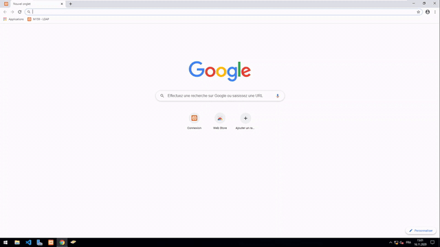

# PHP-M159-LDAP

Projet permettant d'éditer les utilisateurs d'un annuaire LDAP, pour le module 159

## Prérequis
* XAMPP
* Les dll libeay32.dll et ssleay32.dll (à placer dans le dossier *php* de XAMPP)
* Un annuaire LDAP

## Installation
* Installer XAMPP
* Placer les dll dans le dossier *php* de XAMPP
* Installer un annuaire LDAP (testé uniquement avec Active Directory)
* Cloner ou télécharger ce repository
* Déplacer le repository dans le dossier *htdocs*
* Accéder à l'adresse de XAMPP depuis un navigateur ([localhost](http://localhost) si XAMPP est sur la même machine que le navigateur)

## Fonctionnalités
* Création d'utilisateurs Active Directory

* Connexion avec les utilisateurs crées

* Affichage des informations de l'utilisateur
* Déconnexion

